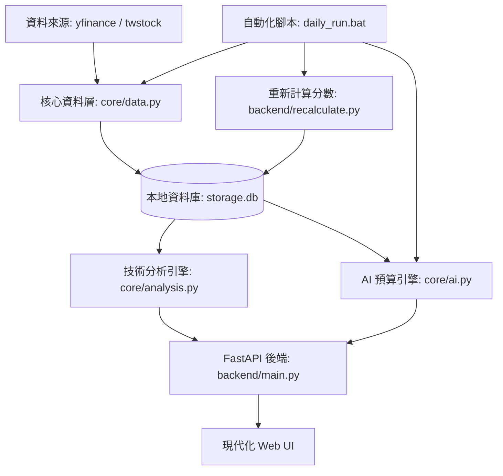

# 智慧選股大師 🚀 AI 狙擊手版 (Smart Stock Selector)

這是一個專為台灣股市 (TWSE) 設計的技術分析儀表板與 AI 預測引擎。

## 🎯 核心理念：「狙擊手」策略

不同於單純預測漲跌的傳統模型，本系統採用 **3:1 損益比狙擊策略**。

* **獲利條件 (Win)**：在 20 個交易日內，股價先觸及 **+15%** (獲利點)，且過程中 **未曾** 觸及 **-5%** (停損點)。
* **AI 目標**：識別出「黃金勝率」的進場時機，即獲利機率遠高於停損機率的訊號。
* **核心價值**：極度挑剔的策略，旨在保護本金的同時追求高爆發性成長。

## 🏗️ 系統架構 (System Architecture)



## ⚙️ 運作流程 (Data Pipeline)


## 🛠️ 技術棧

* **後端 (Backend)**: FastAPI (Python)
* **前端 (Frontend)**: 原生 JS, HTML5, CSS3 (現代化玻璃擬態 UI)
* **資料庫 (Database)**: SQLite (本地持久化存儲)
* **技術分析 (Analysis)**: Pandas, NumPy, 包含 KD, RSI (Wilder's), MACD (Normalized), 布林通道, ATR 等指標
* **人工智慧 (AI/ML)**: Ensemble V3 (結合 GradientBoosting, RandomForest 與 MLP 深度學習模型)

## 🚀 快速上手 (Quick Start)

### 1. 安裝環境

確保您的電腦已安裝 Python，然後執行：

```bash
pip install -r requirements.txt
```

### 2. 資料同步 (資料庫初始化)

下載台股約 1000 檔股票的歷史資料到本地資料庫：

```bash
# 方法 A: 啟動後在網頁點擊 "Sync Data" 按鈕
# 方法 B: 直接執行伺服器程式碼 (伺服器啟動後才能同步)
python backend/main.py
```

*(同步過程約需 10-15 分鐘，請耐心等候)*

### 3. 每日自動更新 (推薦)

直接執行自動化腳本，即可完成「資料同步 -> AI 訓練 -> 分數重算」所有流程：

**Windows:**

```bash
./daily_run.bat
```

**Mac / Linux:**

```bash
chmod +x daily_run.sh
./daily_run.sh
```

### 4. 介面操作說明

* **🔄 Sync Data 按鈕**: 這是您的「數據心臟更新鍵」。點擊後，系統會即時從網路抓取最新的成交價，並利用現有的 AI 模型進行預測。適合在盤中或收盤後立即查看最新狀態。
* **🎯 狙擊手實戰觀察手冊**: 在儀表板中間新增了實戰指南，包含 **AI 共識檢核**、**技術面關聯性**與**大盤系統風險**三大量化觀察點，協助您分析訊號強度。

### 5. 分步手動執行 (選用)

如果您想手動控制流程：

1. **資料同步**: `python backend/main.py --sync`
2. **AI 訓練**: `python backend/train_ai.py`
3. **分數重算**: `python backend/recalculate.py`

### 5. 啟動儀表板

```bash
python backend/main.py
```

訪問網址：`http://localhost:8000/static/index.html`

## ✨ 亮點功能 (Feature Highlights)

| 功能 | 說明 |
| :--- | :--- |
| **Ensemble V3 AI** | 結合三種異質機器學習模型，穩定性比單一模型提升 30%。 |
| **AI Sniper 策略** | 專注於 3:1 損益比，只在勝率最高的時機發出訊號。 |
| **AI 虛擬分析師** | 自動生成技術面解釋報告，解決 AI 「黑盒子」問題。 |
| **玻璃擬態 UI** | 現代化、深色模式友好的流線性介面，極速響應。 |
| **一鍵腳本** | `daily_run.bat` 讓每日資料更新與訓練變得極其簡單。 |

## 📁 專案結構

* `backend/`: FastAPI 接口與背景同步邏輯。
* `core/`: 核心邏輯，包含資料抓取 (`data.py`)、技術指標 (`analysis.py`)、與 AI 模型 (`ai.py`)。
* `frontend/`: 響應式儀表板前端檔案。
* `storage.db`: 本地 SQLite 資料庫 (自動生成)。

## 📜 授權條款

MIT License
