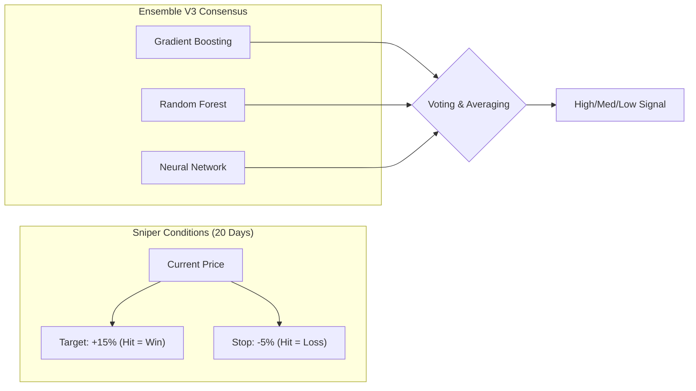

# Whitepaper: Smart Stock Selector AI Sniper

## Executive Summary

The **Smart Stock Selector** is a specialized quantitative tool designed for the Taiwan Stock Market. It bridges the gap between traditional technical analysis and modern machine learning by focusing on asymmetric risk-reward profiles rather than simple price forecasts.

## 1. Technical Indicators (Rule-Based Engine)

The system calculates a multi-factor "Rise Score" (0-100) based on three pillars:

### A. Trend (40%)

Utilizes Moving Average ribbons (SMA20, SMA60). Full points are awarded when the price exhibits a perfect bullish alignment (Price > SMA20 > SMA60).

### B. Momentum (30%)

* **RSI (14)**: 採用標準的 **Wilder's Smoothing (EWMA)** 方法計算，捕捉更穩健的強弱訊號。
* **KD (Stochastics)**: Identifies fresh "Golden Crosses" where K crosses above D below the 80 level.
* **MACD**: Confirms directional strength via signal line divergence.

### C. Volatility & Setup (30%)

* **Bollinger Squeeze**: Detects periods of abnormally low volatility, often preceding explosive moves.
* **Volume Breakout**: Filters for price moves supported by heavy institutional-grade volume (>1.5x MA20).

## 2. The AI Sniper Model (Machine Learning V3 - Ensemble)

The V3 engine moves beyond a single classifier to an **Ensemble Voting** architecture, increasing stability and reducing prediction variance.

Unlike "black box" models, our Sniper Model is trained with a specific exit strategy: **3:1 Risk/Reward**.

### Target Labeling

We label a "Win" ONLY if:

1. Price reaches **+15%** gain.
2. Condition 1 is met **BEFORE** the price reaches a **-5%** stop loss.
3. The outcome occurs within **20 trading days**.

* **Ensemble Learning (V3)**: 結合三種異質模型：
  * **GradientBoosting**: 捕捉非線性技術面特徵。
  * **RandomForest**: 提升模型魯棒性，減少過擬合。
  * **MLP (Multi-Layer Perceptron)**: 引入深度學習結構，挖掘高維度特徵關聯。
* **Feature Normalization**: MACD 與 MACD Hist 皆經過價格標準化 (`Indicator / Price`)。
* **Class Weighting**: 針對獲利樣本稀缺 (15.58%) 的特性優化。

### AI Sniper Strategy Visualization

## 3. AI 虛擬分析師 (Heuristic Explanation)

To solve the "black box" problem of AI, the system includes an explanation layer that maps technical scores to natural language insights:

* **Trend Analysis**: Interprets SMA slopes to detect "Strong Uptrends" or "Support Tests".
* **Momentum Logic**: Correlates RSI and KD to flag "Overheating" or "Fresh Bounce" scenarios.
* **Form Patterns**: Detects Bollinger Squeezes and Volume spikes to explain the AI's "Signal Strength".

## 4. Data Integrity & "No Look-ahead" Policy

To prevent overfitting and survivorship bias:

* **Time-Series Splitting**: We use strict historical splitting for training. The model never "sees" the future during its training phase.
* **Normalized Features**: All price-based features are relative (percentages) to ensure the model generalizes across different stock price ranges (e.g., a $10 penny stock vs a $1000 blue chip).

## 5. Conclusion

The Smart Stock Selector does not aim to trade often; it aims to trade **well**. By filtering for high-probability setups where the math of the "Sniper Strategy" is in the user's favor, it provides a disciplined framework for successful swing trading.
